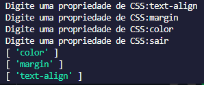

<h2 align="center">Sprint 1 - módulo IV</h2>

 

 Como é o projeto:

 ◆ Vamos usar o Node para montar um código que vai receber uma
lista de propriedades de CSS (ex: background-color, font-size,
text-align) e vai devolver essa lista ordenada de A-Z. Ordenar o CSS
ajuda a encontrar mais rápido a propriedade que precisamos
alterar .
  ◆ O código deve rodar em um laço que vai receber propriedades até
a pessoa digitar a palavra “SAIR”, quando isso acontecer vai ser
impresso no terminal a lista das propriedades ordenadas de A-Z
uma em cada linha.

  ➔ Exemplo:
  ◆ Input:
  font-size
  background-color
  text-align
  border
  SAIR
  ◆ Resultado:
  background-color
  border
  font-size
  text-align

 Resultado:

 

 
Tecnologias utilizadas:

- Javascript
- Node.js
- NPM
- Biblioteca: 'prompt-sync' ([NPM: prompt-sync](https://www.npmjs.com/package/prompt-sync))

